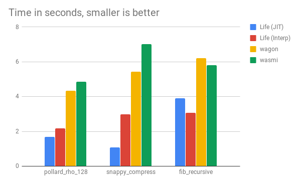

# Life

[![GoDoc][1]][2] [![Discord][7]][8] [![MIT licensed][5]][6] [![Build Status][9]][10] [![Go Report Card][11]][12]

[1]: https://godoc.org/github.com/perlin-network/life?status.svg
[2]: https://godoc.org/github.com/perlin-network/life
[5]: https://img.shields.io/badge/license-MIT-blue.svg
[6]: LICENSE
[7]: https://shields.dougley.com/discord/458332417909063682.svg
[8]: https://discord.gg/dMYfDPM
[9]: https://travis-ci.org/perlin-network/life.svg?branch=master
[10]: https://travis-ci.org/perlin-network/life
[11]: https://goreportcard.com/badge/github.com/perlin-network/life
[12]: https://goreportcard.com/report/github.com/perlin-network/life

**life** is a secure & fast WebAssembly VM built for decentralized applications, written in [Go](https://golang.org/) by Perlin Network.

## Features

- **Fast** - Includes a fast interpreter and an experimental AOT compilation engine.
- **Correct** - Implements WebAssembly execution semantics and passes most of the [official test suite](https://github.com/WebAssembly/testsuite) (66/72 passed, none of the failures are related to the execution semantics).
- **Secure** - User code executed is fully sandboxed. A WebAssembly module's access to resources (instruction cycles, memory usage) may easily be controlled to the very finest detail.
- **Pure** - Does not rely on any native dependencies in interpreter-only mode, and may easily be cross-compiled for running WebAssembly modules on practically any platform (Windows/Linux/Mac/Android/iOS/etc).
- **Practical** - Make full use of the minimal nature of WebAssembly to write code once and run anywhere. Completely customize how WebAssembly module imports are resolved and integrated, and have complete control over the execution lifecycle of your WebAssembly modules.


## Getting Started

```bash
# enable go modules: https://github.com/golang/go/wiki/Modules
export GO111MODULE=on

# download the dependencies to vendor folder
go mod vendor

# build test suite runner
go build github.com/perlin-network/life/spec/test_runner

# run official test suite
python3 run_spec_tests.py /path/to/testsuite

# build main program
go build

# run your wasm program
# entry point is `app_main` by default if entry flag is omitted, array with 
# param in it is optional arguements for entrypoint. params should be converted into `int`.
./life -entry 'method' /path/to/your/wasm/program.wasm [param,...] 

# run your wasm program with the Polymerase AOT compilation engine enabled
./life -polymerase -entry 'method' /path/to/your/wasm/program.wasm [param,...]

```

## Executing WebAssembly Modules

Suppose we have already loaded our *.wasm module's bytecode into the variable `var input []byte`.

Lets pass the bytecode into a newly instantiated virtual machine:
```go
vm, err := exec.NewVirtualMachine(input, exec.VMConfig{}, &exec.NopResolver{}, nil)
if err != nil { // if the wasm bytecode is invalid
    panic(err)
}
```

Lookup the function ID to a desired entry-point function titled `app_main`:
```go
entryID, ok := vm.GetFunctionExport("app_main") // can be changed to your own exported function
if !ok {
    panic("entry function not found")
}
```

And startup the VM; printing out the result of the entry-point function:
```go
ret, err := vm.Run(entryID)
if err != nil {
    vm.PrintStackTrace()
    panic(err)
}
fmt.Printf("return value = %d\n", ret)
```

Interested to tinker with more options? Check out our fully-documented example [here](main.go) .

## Import Resolvers

One extremely powerful feature is that you may completely customize how WebAssembly module import functions are resolved, executed, and defined.

With import resolvers, you may now securely call external code/functions inside your WebAssembly modules which are executed through **life**.

Take for example the following Rust module compiled down to a WebAssembly module:

```rust
extern "C" {
    fn __life_log(msg: *const u8, len: usize);
}

#[no_mangle]
pub extern "C" fn app_main() -> i32 {
    let message = "This is being called outside of WebAssembly!".as_bytes();

    unsafe {
        __life_log(message.as_ptr(), message.len());
    }

    return 0;
}
```

We can define an import resolver into our WebAssembly virtual machine that will let us define whatever code the function `__life_log` may execute in our host environment.

```go
type Resolver struct{}

func (r *Resolver) ResolveFunc(module, field string) exec.FunctionImport {
	switch module {
	case "env":
		switch field {
		case "__life_log":
			return func(vm *exec.VirtualMachine) int64 {
				ptr := int(uint32(vm.GetCurrentFrame().Locals[0]))
				msgLen := int(uint32(vm.GetCurrentFrame().Locals[1]))
				msg := vm.Memory[ptr : ptr+msgLen]
				fmt.Printf("[app] %s\n", string(msg))
				return 0
			}

		default:
			panic(fmt.Errorf("unknown import resolved: %s", field))
		}
	default:
		panic(fmt.Errorf("unknown module: %s", module))
	}
}

func (r *Resolver) ResolveGlobal(module, field string) int64 {
	panic("we're not resolving global variables for now")
}

```

We can then include the import resolver into our WebAssembly VM:

```go
vm, err := exec.NewVirtualMachine(input, exec.VMConfig{}, new(Resolver), nil)
if err != nil {
    panic(err)
}
```

And have the VM run the entry-point function `app_main` to see the result:

```bash
[app] This is being called from outside WebAssembly!
```

## Benchmarks

We benchmarked **life** alongside a couple of other WebAssembly implementations in different programming languages ([go-interpreter/wagon](https://github.com/go-interpreter/wagon), [paritytech/wasmi](https://github.com/paritytech/wasmi)).

<p align="center">
	
</p>

Raw results are [here](https://gist.github.com/losfair/5605f61602537916f342c3e4ace1cc9b).

## Contributions

We at Perlin love reaching out to the open-source community and are open to accepting issues and pull-requests.

For all code contributions, please ensure they adhere as close as possible to the following guidelines:

1. **Strictly** follows the formatting and styling rules denoted [here](https://github.com/golang/go/wiki/CodeReviewComments).
2. Commit messages are in the format `module_name: Change typed down as a sentence.` This allows our maintainers and everyone else to know what specific code changes you wish to address.
    - `compiler/liveness: Implemented full liveness analysis.`
    - `exec/helpers: Added function to run the VM with time limit.`
3. Consider backwards compatibility. New methods are perfectly fine, though changing the existing public API should only be done should there be a good reason.

If you...

1. love the work we are doing,
2. want to work full-time with us,
3. or are interested in getting paid for working on open-source projects

... **we're hiring**.

To grab our attention, just make a PR and start contributing.

